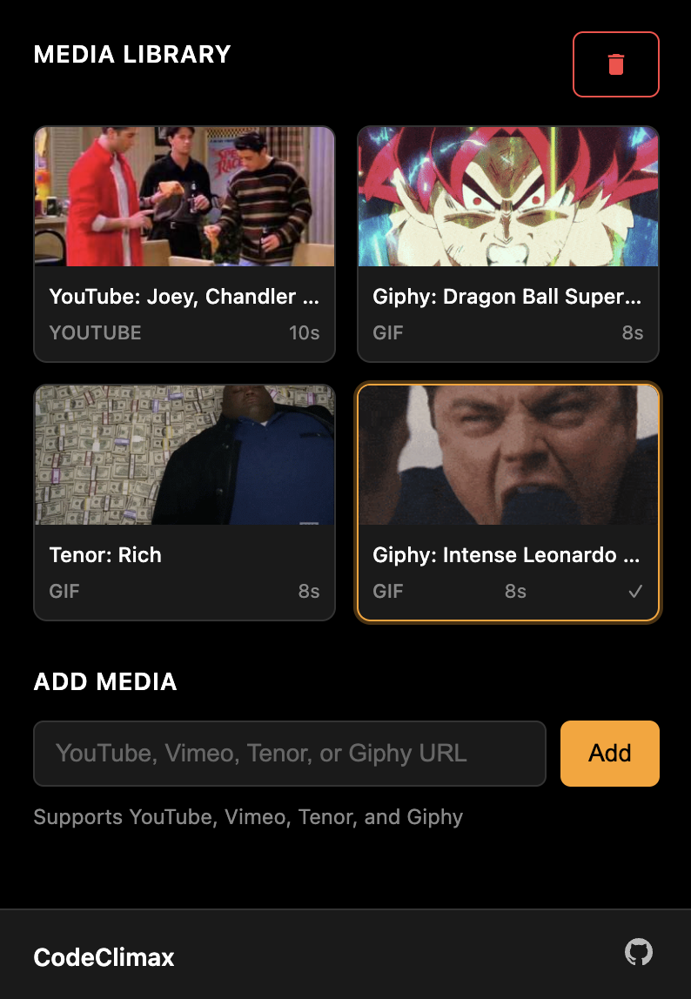

<div align="center">
  
</div>

# CodeClimax 🏔️

**Level up your LeetCode experience with custom celebration media!**

CodeClimax is a minimalist Chrome extension that celebrates your problem-solving successes with custom media. When you solve a LeetCode problem, the extension detects your success and displays a celebration overlay with your chosen media.

## 📸 Extension Preview

<div align="center">
  
</div>

---

## ✨ Features

### 🎬 Media Support
- **YouTube Videos**: Add 10-second clips from any YouTube video
- **Tenor GIFs**: Add high-quality GIFs from Tenor
- **Easy Selection**: Choose specific media for celebrations with one click

### 🎨 Clean Design
- **LeetCode Theme**: Black, yellow, and white color scheme that matches LeetCode
- **Minimal Interface**: No clutter, just what you need
- **Professional Look**: Clean typography and smooth animations

### ⚡ Easy to Use
- **Single URL Input**: One input field for both YouTube and Tenor URLs
- **Click to Select**: Simply click on any media to select it for celebrations
- **One-Click Management**: Easy edit, delete, and organize functionality

---

## 🚀 Installation

1. **Download the extension**
   ```bash
   git clone https://github.com/prxshetty/CodeClimax.git
   cd CodeClimax
   ```

2. **Open Chrome Extensions**
   - Open Chrome browser
   - Go to `chrome://extensions/`
   - Enable **"Developer mode"** (top right toggle)

3. **Load the extension**
   - Click **"Load unpacked"**
   - Select the `CodeClimax` folder you downloaded
   - The extension is now installed!

4. **Verify installation**
   - Look for the CodeClimax icon in your Chrome toolbar
   - Click the icon to open the settings panel

---

## 📖 How to Use

### Adding Your First Celebration

1. **Open CodeClimax Settings**
   - Click the CodeClimax icon in your Chrome toolbar
   - The settings panel will open

2. **Add Media**
   - Find a YouTube video or Tenor GIF you like
   - Copy the URL (examples below)
   - Paste it into the "YouTube or Tenor URL" field
   - Click "Add"

3. **Select for Celebrations**
   - Click on any media item in your library to select it
   - Selected items will have a yellow border and checkmark
   - That's it! Your selection will now play when you solve problems

### Supported URLs

**YouTube Videos:**
- `https://youtube.com/watch?v=dQw4w9WgXcQ`
- `https://youtu.be/dQw4w9WgXcQ`
- `https://youtube.com/shorts/dQw4w9WgXcQ`
- `https://youtube.com/embed/dQw4w9WgXcQ`

**Tenor GIFs:**
- `https://tenor.com/view/excited-celebration-dance-gif-12345678`

### Managing Your Library

**Delete Media:**
- Click the 🗑️ delete button on any media item
- Confirm the deletion
- The media will be removed from your library

**Clear All:**
- Click the trash icon in the Media Library header
- This removes all media except the default celebration
- Useful for starting fresh

---

## 🎯 How It Works

### Success Detection
CodeClimax automatically detects when you successfully solve a LeetCode problem using:

1. **DOM Monitoring**: Watches for success indicators on the page
2. **Smart Detection**: Recognizes "Accepted", "Success", and "Passed" messages
3. **Prevention of Duplicates**: Avoids showing multiple celebrations for the same problem

### Media Selection Logic
When you solve a problem, CodeClimax chooses celebration media in this order:

1. **User Selected**: If you explicitly selected media, it plays first
2. **User Uploads**: Any media you've uploaded
3. **Default**: The classic DiCaprio celebration

### Storage
- All media and settings are stored locally in your browser
- No data is sent to external servers
- Your privacy is protected

---

## 🔧 Advanced Features

### Keyboard Shortcuts
- **Enter**: Submit URL when typing in the URL field
- **Esc**: Close modal dialogs

### Selection System
- **Click to Select**: Click any media item to select it for celebrations
- **Visual Feedback**: Selected items show a yellow border
- **Toggle Selection**: Click a selected item again to deselect
- **One Selection Only**: Only one media can be selected at a time


---

## 🛠️ Troubleshooting

### Extension Not Working
**Problem**: Celebrations don't appear when solving problems
**Solutions**:
1. Make sure you're on a LeetCode problem page (`leetcode.com/problems/*`)
2. Check that the extension is enabled (no errors in Chrome extensions page)
3. Refresh the LeetCode page after installing the extension
4. Try solving a simple problem to test

### Media Not Adding
**Problem**: "Error adding media" message
**Solutions**:
1. Check that the URL is correct (copy/paste directly from YouTube/Tenor)
2. Make sure the video/GIF is public and accessible
3. Try a different URL to test
4. Check your internet connection

### Media Not Playing
**Problem**: Black screen or media doesn't load
**Solutions**:
1. Check your internet connection
2. Try selecting a different media item
3. Clear the extension data and re-add media
4. Some YouTube videos may have restrictions - try another one

### Reset Extension
If everything else fails:
1. Open CodeClimax settings
2. Click the trash icon to clear all media
3. Refresh LeetCode pages
4. Re-add your media

---

## 💡 Tips & Tricks

### For Best Experience
1. **Use Short Clips**: YouTube videos work best with short, celebratory moments
2. **High-Quality GIFs**: Tenor GIFs are optimized and load quickly
3. **Organize**: Name your media clearly so you can find favorites easily
4. **Test**: After adding media, test it by selecting it and solving a problem

### Recommended Media Types
- **Victory Scenes**: Movie celebration moments
- **Dance GIFs**: Fun dance moves or celebrations
- **Achievement Clips**: Gaming or sports victory moments
- **Meme Reactions**: Popular celebration memes

### Pro Tips
- Selected media always plays when you solve a problem
- Clear media library periodically to remove unused items
- Test your media by selecting it and solving a problem

---

## 🔒 Privacy & Security

- ✅ **No Data Collection**: No data is sent to external servers
- ✅ **Local Storage**: All media stored locally in your browser
- ✅ **Minimal Permissions**: Only requires necessary permissions
- ✅ **Open Source**: All code is transparent and reviewable
- ✅ **No Tracking**: No analytics or tracking scripts

### Permissions Explained
- `storage`: Saves your media and settings locally
- `activeTab`: Detects LeetCode success states
- `host_permissions`: Access YouTube and Tenor for media validation

---

## 🤝 Contributing

We welcome contributions! Here's how to help:

### Reporting Issues
1. Check existing issues on GitHub
2. Create a detailed bug report
3. Include:
   - Chrome version
   - Steps to reproduce
   - Expected vs actual behavior
   - Screenshots if applicable

### Feature Requests
1. Check if already requested
2. Describe the feature clearly
3. Explain why it would be useful
4. Provide examples if possible

### Code Contributions
1. Fork the repository
2. Create a feature branch
3. Make your changes
4. Test thoroughly
5. Submit a pull request

---

## 📄 License

This project is licensed under the MIT License - see the [LICENSE](LICENSE) file for details.

---


